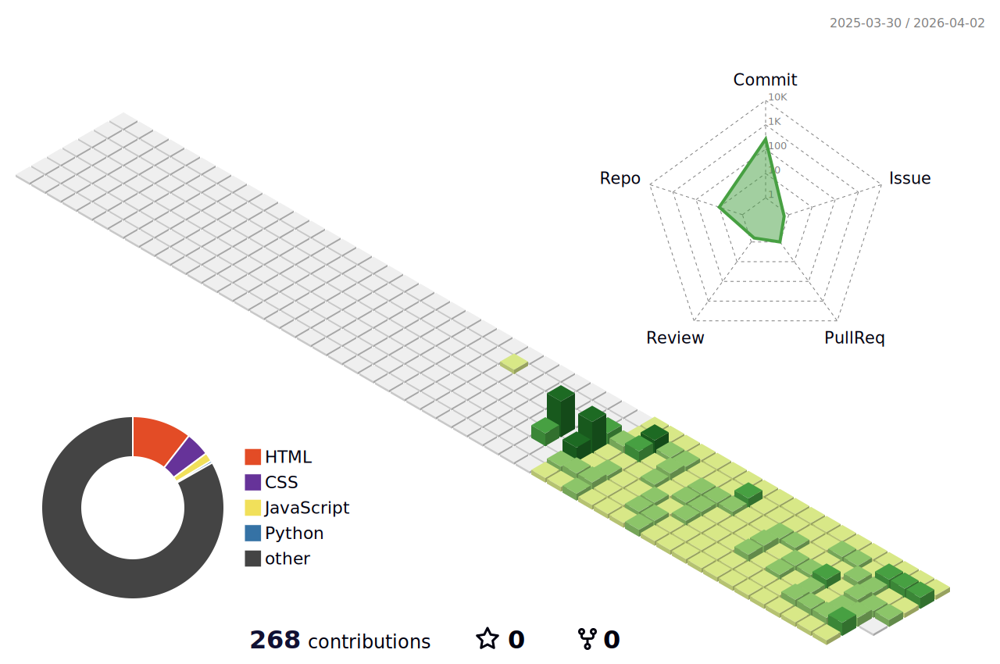

  
  <!--Header-->
  
  

  <!--Body-->
  
  ## 👀 About Me
  #### :raising_hand: Hello, My name in shin da eun. 
  #### :fire: Learning, improving and finding my place in tech. 
  #### :mortar_board: Hankuk University of Foreign Studies(HUFS)
   
   
  
  
  ## :yellow_heart: Github Stats

   
  

  ## :seedling: GitHub contribution
  

  
  

<!--
**cr-rlo/cr-rlo is a ✨ _special_ ✨ repository because its `README.md` (this file) appears on your GitHub profile.

Here are some ideas to get you started:
- Hi there 👋
- 🔭 I’m currently working on ...
- 🌱 I’m currently learning ...
- 👯 I’m looking to collaborate on ...
- 🤔 I’m looking for help with ...
- 💬 Ask me about ...
- 📫 How to reach me: ...
- 😄 Pronouns: ...
- ⚡ Fun fact: ...
-->
